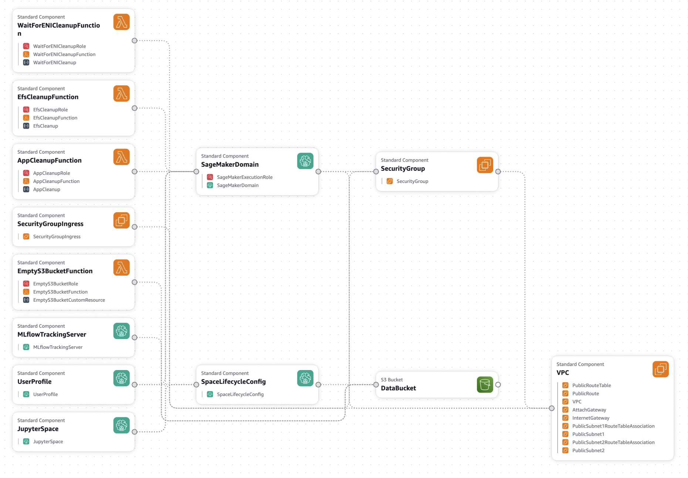

# CloudFormation: SageMaker + MLflow Setup

Single-stack deployment of a ready-to-use SageMaker Studio environment for the automated drift and trend monitoring solution. The stack provisions the domain, user profile, JupyterLab space, MLflow tracking server, and supporting infrastructure, then auto-clones the project repo and generates a `.env` file on first space launch.

## What the Stack Creates

The template (`sagemaker-mlflow-setup.yaml`) provisions:

- **VPC** with two public subnets, Internet Gateway, route table, and security group
- **SageMaker Domain** (`PublicInternetOnly` mode) with an IAM execution role
- **User Profile** and a **JupyterLab Space** configured to use a lifecycle script
- **Lifecycle configuration** that clones the GitHub repo and writes a populated `.env` file into the space on first launch
- **MLflow tracking server** with S3-backed artifact store and auto-registration
- **S3 data bucket** with versioning, encryption, and lifecycle rules
- **Cleanup Lambdas** for S3 object cleanup, ENI cleanup, and SageMaker app cleanup so the stack deletes cleanly

Policy names and role names are parameterized by `ProjectName`, so the same template can be deployed multiple times in the same account with different parameter values.

### Resource Layout

The following Infrastructure Composer view shows how the resources are wired together:



### Creation Timeline and Dependencies

The diagram below shows the creation order and dependencies between resources:


## Prerequisites

- AWS CLI configured with credentials for the target account
- IAM permissions to create CloudFormation stacks, IAM roles, SageMaker domains, Lambda functions, and VPC resources
- A supported region (template defaults assume SageMaker + MLflow availability)

## Deploy

```bash
aws cloudformation create-stack \
  --stack-name fraud-detection-monitoring \
  --template-body file://sagemaker-mlflow-setup.yaml \
  --capabilities CAPABILITY_NAMED_IAM \
  --region <your-region>

aws cloudformation wait stack-create-complete \
  --stack-name fraud-detection-monitoring \
  --region <your-region>
```

Creation takes roughly 10–15 minutes (most of it is the MLflow tracking server).

### Optional Parameters

| Parameter | Purpose |
|-----------|---------|
| `ProjectName` | Prefix for all named resources (default: `fraud-detection-monitoring`) |
| `UserProfileName` | Name of the SageMaker user profile |
| `JupyterLabInstance` | Instance type for the JupyterLab space |
| `GitHubRepo` | Repo URL that the lifecycle script clones |
| `UseExistingBucket` / `UseExistingRole` / `UseExistingVPC` | Reuse existing resources instead of creating new ones |

Pass parameters with `--parameters ParameterKey=<name>,ParameterValue=<value>`.

## After Deploy

1. Open the SageMaker console → Domains → `<ProjectName>-domain`
2. Select the user profile and click **Spaces → Run Space**
3. Once JupyterLab starts, open the terminal and confirm:
   - `sample-mlops-bestpractices/` directory is present
   - `.env` file has AWS region, execution role, MLflow ARN, and data bucket populated
4. Get the MLflow web UI URL (CloudFormation doesn't expose it as an attribute):

   ```bash
   aws sagemaker describe-mlflow-tracking-server \
     --tracking-server-name <ProjectName>-mlflow \
     --query TrackingServerUrl --output text \
     --region <your-region>
   ```

For Python code, use the `MLFLOW_TRACKING_URI` ARN already written to `.env` — the SageMaker Python SDK resolves the ARN internally.

## Update

CloudFormation handles updates, including domain replacement when immutable properties change. Any running JupyterLab apps are torn down automatically by the app-cleanup Lambda before the old space is deleted.

```bash
aws cloudformation update-stack \
  --stack-name fraud-detection-monitoring \
  --template-body file://sagemaker-mlflow-setup.yaml \
  --capabilities CAPABILITY_NAMED_IAM \
  --region <your-region> \
  --parameters ParameterKey=ProjectName,UsePreviousValue=true
```

Domain replacement typically takes 10–15 minutes.

## Delete

```bash
aws cloudformation delete-stack \
  --stack-name fraud-detection-monitoring \
  --region <your-region>

aws cloudformation wait stack-delete-complete \
  --stack-name fraud-detection-monitoring \
  --region <your-region>
```

The stack deletes cleanly without manual intervention:

1. The app-cleanup Lambda deletes any JupyterLab apps in the space
2. CloudFormation deletes the space, user profile, domain, and MLflow server
3. The ENI-cleanup Lambda waits for SageMaker-created ENIs to detach from the subnets
4. The S3-cleanup Lambda empties the data bucket so it can be deleted
5. VPC, subnets, IAM roles, and remaining resources are torn down

`cleanup-stack.sh` is available as a manual fallback if deletion ever gets stuck.

## Troubleshooting

**Stack creation fails quickly with an IAM or name conflict**
Another stack with the same `ProjectName` already exists in the account. Delete it or pick a different `ProjectName`.

**JupyterLab space shows `Failed`**
Check CloudWatch Logs under `/aws/sagemaker/studio` for the space, filtered by domain ID. The lifecycle script logs each step and runs `curl -I https://github.com` on failure so connectivity issues are visible.

**`git clone` times out during space launch**
Confirm `AppNetworkAccessType` on the domain is `PublicInternetOnly` — that's what the template sets. In `VpcOnly` mode, git clone requires a NAT Gateway or private DNS endpoints that this template doesn't provision.

**Stack deletion stuck on subnet or bucket**
The ENI-cleanup and S3-cleanup Lambdas handle this, but if they ever time out, re-run `delete-stack` after a few minutes. If the stack reaches `DELETE_FAILED`, use `force-delete-stack.sh <stack-name> <region>` — it empties the bucket, removes stuck SageMaker ENIs, manually deletes the subnets, retries the delete with `--retain-resources`, and cleans up leftover Lambdas and IAM roles. `cleanup-stack.sh` is the lighter-weight helper for pre-delete prep (stopping apps and waiting for ENIs).

## Files

| File | Purpose |
|------|---------|
| `sagemaker-mlflow-setup.yaml` | The CloudFormation template |
| `cfn-infrastructure-composer.png` | Infrastructure Composer view of the resource layout |
| `Stack-timeline.png` | Creation timeline and dependency ordering of the stack resources |
| `cleanup-stack.sh` | Clean deletion helper (stops apps and waits for ENIs before re-running delete) |
| `force-delete-stack.sh` | Force-cleanup for a stuck `DELETE_FAILED` stack (empties S3 bucket, removes stuck ENIs, deletes subnets, retries delete with `--retain-resources`) |
| `README.md` | This file |
