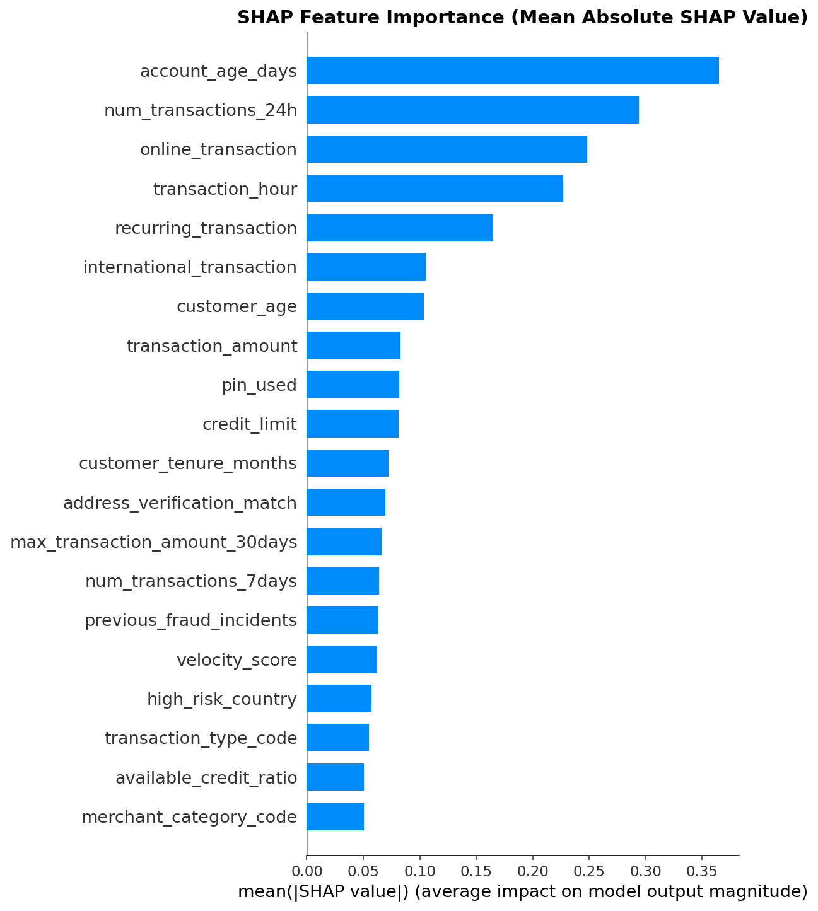
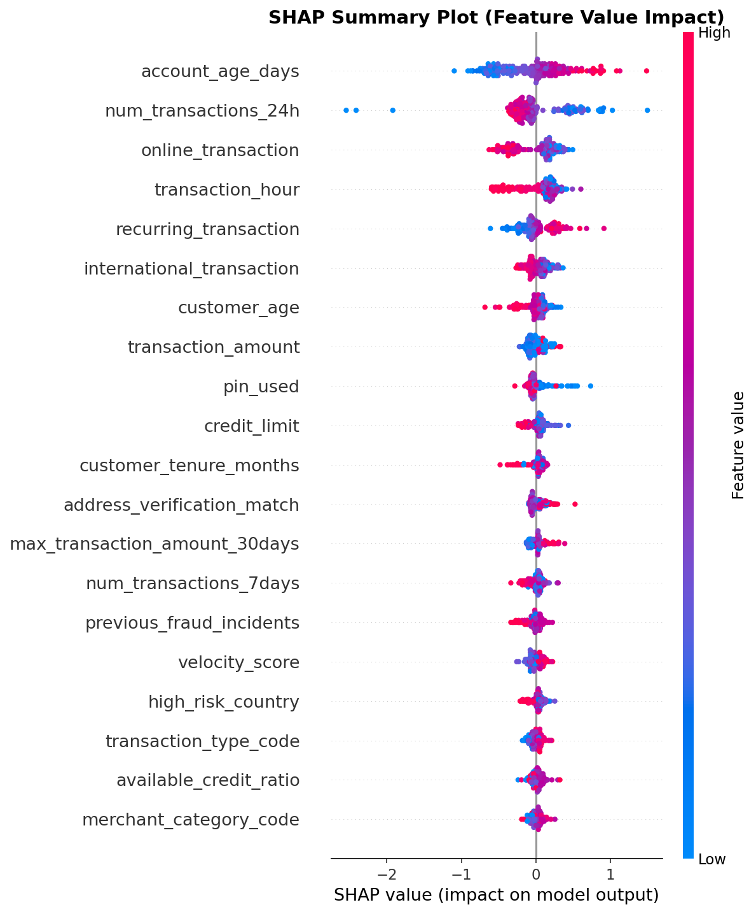
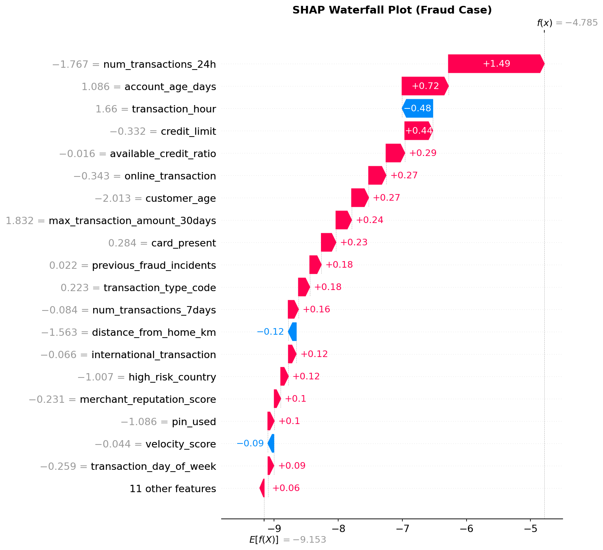
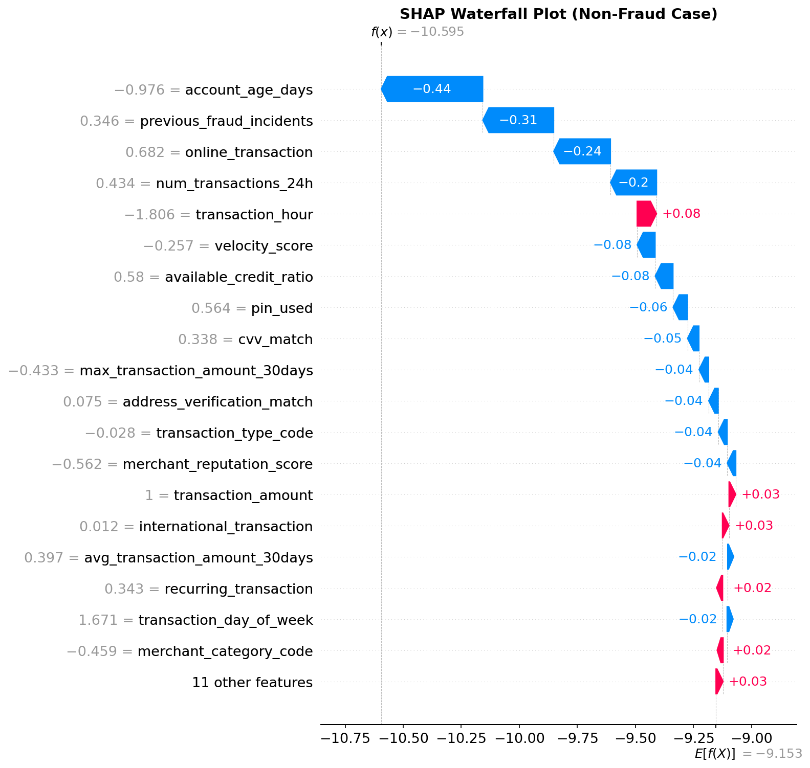
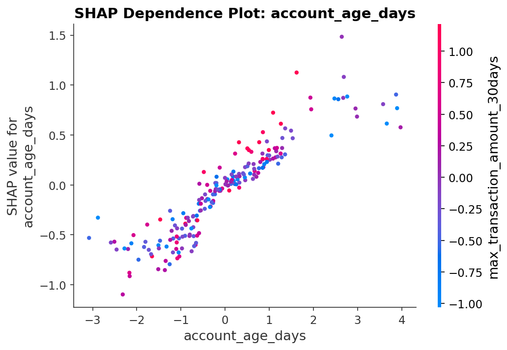
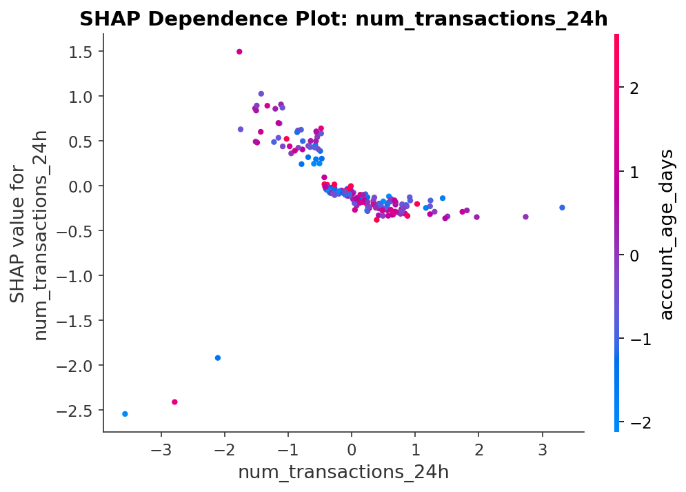
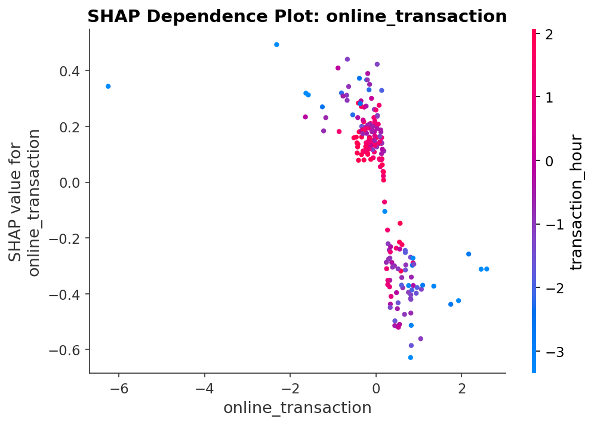
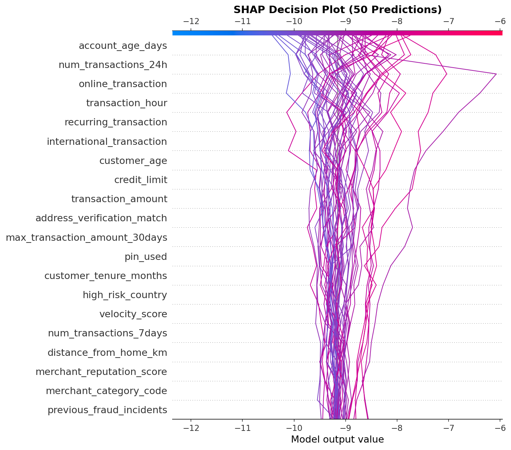

# SHAP Explainability Analysis Results

This directory contains SHAP (SHapley Additive exPlanations) analysis results for the fraud detection XGBoost model. SHAP values explain individual predictions by quantifying each feature's contribution.

## 📊 What is SHAP?

SHAP values are based on game theory (Shapley values) and provide:
- **Global interpretability**: Which features are most important overall?
- **Local interpretability**: Why did the model make this specific prediction?
- **Mathematical guarantees**: Consistent, additive explanations where `base_value + sum(shap_values) ≈ model_prediction`

---

## 🎯 Global Feature Importance

### 1. Feature Importance (Bar Chart)



**What this shows**: Features ranked by their average impact on model output magnitude (mean absolute SHAP value).

**Key Insights**:
- **Top 3 most important features**:
  1. **account_age_days** (0.365) - Newer accounts are higher risk
  2. **num_transactions_24h** (0.294) - Velocity indicator for fraud
  3. **online_transaction** (0.248) - Online vs. physical store matters

**Interpretation**:
- Account age and transaction velocity are the strongest fraud signals
- Online transactions carry different risk profiles than in-person
- Transaction timing (hour of day) is significant for fraud detection

---

### 2. Feature Value Impact (Beeswarm Plot)



**What this shows**: How feature values affect predictions. Each dot is a sample.

**How to read**:
- **X-axis**: SHAP value (left = decreases fraud prob, right = increases fraud prob)
- **Color**: Feature value (pink/red = high, blue = low)
- **Vertical spread**: Distribution of samples

**Key Insights**:

1. **account_age_days**:
   - **Low values (blue)** → Push right → **Increase fraud probability**
   - Newer accounts are riskier (common fraud pattern)

2. **num_transactions_24h**:
   - **High values (pink)** → Push right → **Increase fraud probability**
   - Many transactions in 24 hours = velocity fraud indicator

3. **online_transaction**:
   - **High values (pink)** → Spread on both sides
   - Online transactions show more variable risk

4. **transaction_hour**:
   - Certain hours are more associated with fraud
   - Time-of-day patterns matter for risk assessment

**Business Implications**:
- Monitor new accounts more closely
- Flag high-velocity transaction patterns
- Apply stricter rules for online transactions during risky hours

---

## 🔍 Individual Prediction Explanations

### 3. Fraud Case - Waterfall Plot



**What this shows**: Why the model predicted this transaction as **HIGH FRAUD RISK**.

**How to read**:
- **Base value** (E[f(x)]): Expected fraud probability across all data (~0.001)
- **Red bars** (pointing right): Features **increasing** fraud probability
- **Blue bars** (pointing left): Features **decreasing** fraud probability
- **Final prediction**: Sum of base value + all feature contributions

**Key Fraud Indicators in this case**:
1. **account_age_days** (strong positive) - New account
2. **num_transactions_24h** (strong positive) - High velocity
3. **online_transaction** (positive) - Online channel risk
4. **transaction_hour** (positive) - Suspicious timing

**Anti-Fraud Signals**:
- Some features like `pin_used`, `cvv_match` may provide trust signals but are overwhelmed by risk factors

**Business Action**: This transaction should be **flagged for manual review or declined**.

---

### 4. Non-Fraud Case - Waterfall Plot



**What this shows**: Why the model predicted this transaction as **LOW FRAUD RISK**.

**Key Trust Indicators in this case**:
1. **account_age_days** (strong negative) - Established account
2. **num_transactions_24h** (negative) - Normal velocity
3. **recurring_transaction** (negative) - Regular pattern
4. **pin_used**, **cvv_match** (negative) - Security verification passed

**Risk Factors** (minor):
- Some features may show slight positive contributions but are minor

**Business Action**: This transaction is **safe to approve**.

---

## 🔄 Feature Interactions

### 5. Dependence Plots

These plots reveal how feature values affect SHAP values and show interactions with other features.

#### 5a. Account Age Days



**What this shows**: 
- **X-axis**: Account age (days)
- **Y-axis**: SHAP value (impact on fraud prediction)
- **Color**: Another feature (automatic interaction detection)

**Key Insights**:
- **Newer accounts (left side)** have **higher SHAP values** → increase fraud risk
- Sharp drop-off around 100-200 days - accounts become trusted
- Color variation shows interaction with another feature (likely transaction patterns)

**Business Rule**: Apply stricter fraud checks for accounts < 180 days old.

---

#### 5b. Number of Transactions (24h)



**What this shows**: Transaction velocity indicator.

**Key Insights**:
- **More transactions in 24h** → **higher fraud risk**
- Non-linear relationship: risk accelerates beyond 3-4 transactions
- Color shows interaction with other features (possibly transaction amount or account age)

**Business Rule**: Flag transactions when daily count exceeds normal threshold for customer profile.

---

#### 5c. Online Transaction



**What this shows**: Binary feature (0 = physical store, 1 = online).

**Key Insights**:
- Online transactions (1) show **higher variance in SHAP values**
- Physical store transactions (0) cluster around lower risk
- Color variation reveals strong interaction with other features (likely transaction amount, security checks)

**Business Rule**: Online transactions need additional verification (CVV, 3D Secure) compared to in-person.

---

## 📈 Decision Plot



**What this shows**: How predictions evolve as features are considered (50 sample predictions).

**How to read**:
- **Y-axis**: Features (ordered by importance, bottom to top)
- **X-axis**: Model output (cumulative SHAP values)
- **Each line**: One prediction
- **Lines moving right**: Features increasing fraud probability
- **Lines moving left**: Features decreasing fraud probability

**Key Insights**:
- Most predictions cluster around low fraud probability (left side)
- A few predictions diverge sharply to the right (high fraud risk)
- The first few features (account age, transaction velocity) cause the largest divergence
- Shows how different combinations of features lead to different risk assessments

**Business Value**: Helps identify which features combinations most strongly separate fraud from non-fraud cases.

---

## 💡 Key Takeaways for Business

### Top Risk Factors:
1. **New accounts** (< 180 days) - Highest fraud signal
2. **High transaction velocity** (multiple transactions in 24h)
3. **Online transactions** - Higher risk than in-person
4. **Suspicious transaction timing** (late night/early morning)

### Trust Signals:
1. **Established accounts** (> 180 days)
2. **Normal transaction velocity**
3. **Recurring transaction patterns**
4. **Security verification** (PIN, CVV match)

### Recommended Actions:

**Fraud Prevention**:
- Implement stricter rules for new accounts in first 180 days
- Monitor transaction velocity (flag > 3-4 transactions per day)
- Require additional verification for online transactions
- Apply time-of-day risk scoring

**Customer Experience**:
- Trusted customers (established accounts, recurring patterns) can have streamlined checkout
- Reduce false positives by considering multiple factors holistically
- Use SHAP explanations to explain declined transactions to customers

**Model Monitoring**:
- Track SHAP values over time to detect concept drift
- Compare feature importance across model versions
- Use SHAP to validate that model behavior aligns with business logic

---

## 📁 Files in this Directory

| File | Description |
|------|-------------|
| `shap_summary_bar.png` | Global feature importance ranking |
| `shap_summary_beeswarm.png` | Feature value impact on predictions |
| `shap_waterfall_fraud.png` | Explanation of a high-risk fraud case |
| `shap_waterfall_non_fraud.png` | Explanation of a low-risk legitimate case |
| `shap_dependence_1_account_age_days.png` | How account age affects fraud risk |
| `shap_dependence_2_num_transactions_24h.png` | How transaction velocity affects fraud risk |
| `shap_dependence_3_online_transaction.png` | How online vs. physical affects fraud risk |
| `shap_decision_plot.png` | Multi-sample prediction evolution |
| `shap_force_plot.html` | Interactive force plot (open in browser) |
| `shap_values.csv` | Raw SHAP values for all samples (200 rows × 30 features) |
| `feature_importance.csv` | Feature importance scores (mean absolute SHAP values) |

---

## 🔬 Technical Details

**Model**: XGBoost binary classifier (fraud detection)  
**Samples Analyzed**: 200 predictions  
**Background Dataset**: 500 samples (stratified sampling)  
**Features**: 30 features  
**SHAP Method**: TreeExplainer (exact Shapley values for tree models)  
**Computation Time**: ~0.24 seconds (827 samples/second)  
**Validation**: SHAP additivity check passed (max error < 1e-4)  

**SHAP Value Formula**:
```
model_prediction ≈ base_value + sum(shap_values)
```

This mathematical guarantee ensures explanations are **consistent** and **additive**.

---

## 🚀 How to Regenerate

To regenerate these SHAP plots with updated model or data:

1. Open `notebooks/6_shap_explainability.ipynb`
2. Update `MODEL_RUN_ID` to desired model version (or use latest)
3. Run all cells
4. New plots will be saved to this directory

**Requirements**:
- Trained XGBoost model in MLflow registry
- Training data (CSV or Athena)
- Python environment with SHAP library installed

---

## 📚 References

- **SHAP Paper**: [A Unified Approach to Interpreting Model Predictions](https://arxiv.org/abs/1705.07874)
- **SHAP Documentation**: https://shap.readthedocs.io/
- **TreeExplainer**: Fast exact algorithm for tree-based models
- **Shapley Values**: Game-theoretic concept for fair attribution

---

**Generated**: 2026-05-10  
**Model Version**: 24  
**Experiment**: credit-card-fraud-detection-training  
**Analysis Notebook**: `notebooks/6_shap_explainability.ipynb`
